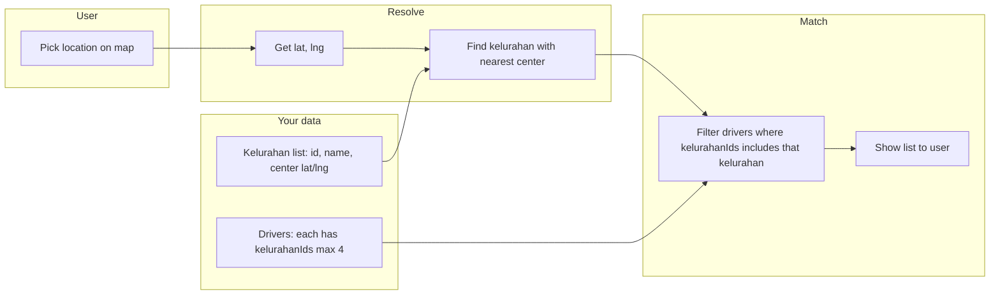

# Driver coverage rule: kelurahan-based matching

Drivers are matched to the user by **kelurahan**, not by GPS distance. The user picks a location on the map; we resolve it to one kelurahan, then show all drivers who cover that kelurahan.

---

## Flow (high level)

```
┌─────────────────┐     ┌──────────────────────────┐     ┌─────────────────────────┐     ┌─────────────────┐
│  User picks     │     │  Resolve to kelurahan    │     │  Get drivers who       │     │  User chooses   │
│  point on map   │ ──► │  (nearest center from    │ ──► │  have that kelurahan    │ ──► │  one driver     │
│  (lat, lng)     │     │  your kelurahan list)    │     │  in their coverage     │     │  from the list  │
└─────────────────┘     └──────────────────────────┘     └─────────────────────────┘     └─────────────────┘
```

---

## Data you provide

| Data | Description |
|------|-------------|
| **Kelurahan list** | Each row: `id`, `name`, `city`, `center` (lat, lng). You maintain this list. |
| **Driver coverage** | Each driver: up to **4** `kelurahanIds`. Multiple drivers can cover the same kelurahan. |

---

## Algorithm: resolve user position → kelurahan

- **Input:** user position `(lat, lng)` from the map.
- **For each** kelurahan in your list, compute **distance** from `(lat, lng)` to that kelurahan’s **center** (Haversine).
- **Output:** the kelurahan whose center is **closest** (no max-distance limit).

No polygon or boundary data needed; center point per kelurahan is enough.

---

## Algorithm: which drivers to show

- **Input:** `kelurahanId` from the step above.
- **Filter:** drivers whose `kelurahanIds` array **contains** this `kelurahanId`.
- **Output:** list of drivers. User picks one (no sorting by GPS distance).

---

## Mermaid flowchart



---

## Where it lives in code

| Step | Where |
|------|--------|
| User picks location | `LocationPickerModal.vue` → emits `{ lat, lng, address }` |
| Resolve to kelurahan | `LocationApiService.getKelurahanForLocation(lat, lng)` → uses your kelurahan list (nearest center) |
| Attach to location | `LocationPickerModal` calls above and adds `kelurahanId`, `kelurahanName` to emitted location |
| Get drivers by kelurahan | `DriverApiService.getAvailableDriversByKelurahan(kelurahanId)` |
| Show & choose | `OrderNow.vue`: list of drivers, user clicks one |

When you have your kelurahan list ready, replace or feed the mock list in `LocationApiService` (e.g. `mockKelurahan` or Supabase) and keep the same flow.
